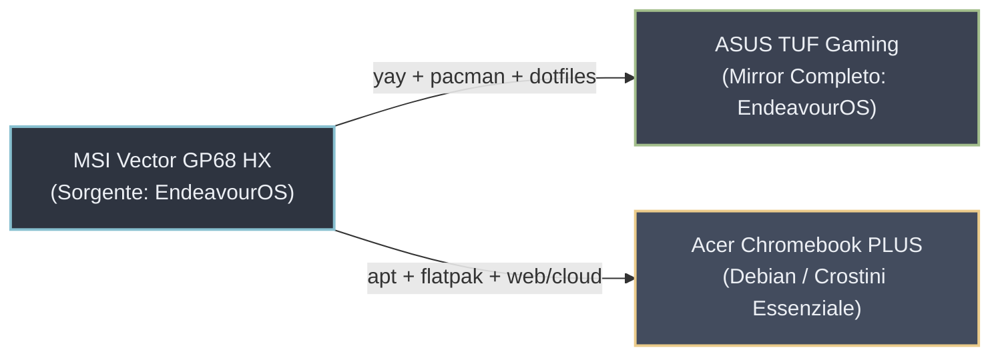
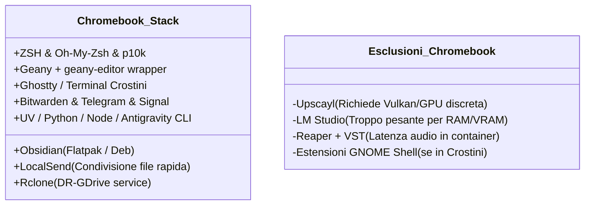

# 🚀 Piano di Allineamento e Migrazione Sistemi

> [!NOTE] Obiettivo del Documento
> Questo documento racchiude l'inventario completo di tutte le personalizzazioni, applicazioni, utility CLI, script wrapper, servizi utente e parametri ZSH estratti dal laptop principale **MSI Vector GP68 HX**.
> 
> - **Parte 1 — ASUS TUF**: Include l'elenco esaustivo per allineare l'ASUS TUF (EndeavourOS / Arch), escludendo l'hardware MSI e i componenti base di sistema gestiti out-of-the-box.
> - **Parte 2 — Acer Chromebook PLUS (Debian / Crostini)**: Seleziona e raccomanda la suite ideale per il Chromebook, ottimizzata per produttività, sviluppo leggero e sincronizzazione continua, con i comandi nativi `apt`, `flatpak` e script shell.
> - **Parte 3 — File di Configurazione e Script Chiave**: I testi integrali dei file custom da replicare al volo.

---

## 🧭 Mappa Rapida delle Macchine



---

# 1. ASUS TUF — Allineamento Completo (EndeavourOS / Arch)

> [!IMPORTANT] Hardware MSI Escluso
> Dal sistema MSI sono stati filtrati ed esclusi i pacchetti strettamente legati alla scheda madre e ai controller proprietari MSI:
> - `mcontrolcenter-bin` e `msi-ec-dkms-git` (specifici per il microcontroller EC dei notebook MSI).
> - Driver video specifici Intel/Nvidia della macchina sorgente (`libva-nvidia-driver`, `libva-intel-driver`, `intel-media-sdk`, `intel-gpu-tools`, `intel-ucode`, ecc.): sull'ASUS TUF la GPU (Nvidia o AMD) va gestita con `nvidia-inst` o i driver dedicati all'hardware TUF.
> - Pacchetti infrastrutturali di bootstrap Calamares (`dracut`, `kernel-install-for-dracut`, `eos-hooks`, ecc.) che sono già presenti nell'installazione base.

---

### 1.1 Applicazioni Desktop & Produttività (GUI)

- [ ] **Note, Scrittura & Documenti**:
  - `obsidian` *(Repo)* — Knowledge base markdown locale
  - `obsidian-cli-inspector-git` *(AUR)* — CLI/TUI per interrogare ed indicizzare vault Obsidian
  - `onlyoffice-bin` *(AUR)* — Suite d'ufficio per formati MS Office
  - `masterpdfeditor` *(AUR)* — Editor PDF avanzato per firme, note e modifiche
  - `foliate` *(Repo)* — Lettore moderno di eBook / ePub
  - `sigil` *(Repo)* — Editor WYSIWYG per standard EPUB2/EPUB3
  - `kcc` *(AUR)* — Kindle Comic Converter (conversione manga/fumetti)
  - `kindlegen` *(AUR)* — Compilatore proprietario Amazon per mobi/azw3
  - `Z-Library` *(Standalone)* — Cartella in `~/App/Z-Library-3.2.1`
  - Dizionari e thesaurus italiano: `aspell-it`, `hunspell-it`, `hyphen-it`, `mythes-it`, `libmythes`
- [ ] **Grafica, Audio & Multimedia**:
  - `gimp` + `gimp-plugin-gmic` + `gimp-help-it` *(Repo)* — Fotoritocco avanzato con suite filtri G'MIC
  - `inkscape` *(Repo)* — Grafica vettoriale SVG
  - `converseen` *(Repo)* — Batch image converter & resizer
  - `caesium-image-compressor-bin` *(AUR)* — Compressore di immagini senza perdita/con perdita
  - `upscayl-bin` *(AUR)* — Upscaler AI basato su rete neurale e Vulkan (perfetto per la GPU del TUF)
  - `reaper` + `reapack` + `sws` *(Repo)* — DAW audio professionale + package manager + estensioni S&M
  - `vlc` + `vlc-plugins-all` *(Repo)* — Player multimediale universale
  - `rhythmbox` + `rhythmbox-plugin-alternative-toolbar-git` *(Repo + AUR)* — Player musicale locale con interfaccia CSD compatta
  - `recordly-bin` *(AUR)* — Screen recorder moderno con auto-zoom, cursor highlights ed esportazione video
- [ ] **Browser, Rete & Comunicazione**:
  - `google-chrome` *(AUR)* — Browser primario
  - `firefox-esr-bin` *(AUR)* — Browser alternativo a rilascio prolungato
  - `bitwarden` *(Repo)* — Gestore password cifrato
  - `signal-desktop` *(Repo)* — Messaggistica sicura Signal
  - `telegram-desktop` *(Repo)* — Client ufficiale Telegram
  - `surfshark-client` *(AUR)* — Client VPN Surfshark
  - `localsend-bin` + `localsend-nautilus-extension` *(AUR)* — Condivisione file LAN stile AirDrop + menu contestuale Nautilus
  - `filezilla` *(Repo)* — Client FTP/SFTP
  - `qbittorrent` *(Repo)* — Client torrent
  - `freedownloadmanager` *(AUR)* — Gestore download multi-connessione
- [ ] **Utility di Sistema Desktop**:
  - `ghostty` *(Repo)* — Emulatore di terminale GPU accelerato moderno
  - `solanum` *(Repo)* — Pomodoro timer GNOME integrato
  - `resources` *(Repo)* — Monitor di sistema grafico stile Activity Monitor / Task Manager
  - `baobab` *(Repo)* — Analizzatore utilizzo disco
  - `gparted` *(Repo)* — Gestione partizioni dischi
  - `flipclock` *(AUR)* — Screensaver / orologio a palette minimalista
  - `gnome-browser-connector` *(Repo)* — Integrazione estensioni GNOME da browser

---

### 1.2 Suite Sviluppo, AI & CLI

- [ ] **AI Coding & Assistenti**:
  - `antigravity-ide` *(AUR)* — IDE agentico Google Antigravity
  - `agy` *(Binario utente)* — CLI Antigravity in `~/.local/bin/agy`
  - `claude` *(NPM / Binario)* — Claude Code CLI (`~/.local/bin/claude`)
  - `opencode-ai` *(NPM Global)* — Framework OpenCode
  - `lmstudio-bin` *(AUR)* — Esecuzione e gestione modelli LLM in locale con accelerazione GPU
  - `geany-ai-chat` *(AUR)* — Plugin Geany per chat AI
- [ ] **Editor Geany & Plugin Suite**:
  - `geany-git` *(AUR)* — Editor principale leggero
  - `geany-nord-theme` *(AUR)* — Tema scuro Nord per Geany
  - `geany-plugin-addons-git` *(AUR)*
  - `geany-plugin-preview-git` *(AUR)* — Anteprima markdown / web live
  - `geany-plugin-spellcheck-git` *(AUR)*
  - `geany-plugin-utilslib-git` *(AUR)*
  - `geany-plugin-webhelper-git` *(AUR)*
  - `github-desktop-bin` *(AUR)* — Client grafico Git
- [ ] **Linguaggi, Runtimes & Pacchettizzatori**:
  - `uv` e `uvx` *(Binari standalone in `~/.local/bin/`)* — Gestore di pacchetti Python ultra-veloce (Astral)
  - `python-pip`, `python-pipx` *(Repo)*
  - Tool Python utente (`pip install --user`): `ezdxf`, `fonttools`, `pyparsing` (forniscono `ezdxf`, `fonttools`, `pyftmerge`, `pyftsubset`, `ttx`)
  - `nodejs-lts-krypton` *(Repo)* + `corepack` + `pnpm` / `pnpx`
  - `nodejs-live-server` *(AUR)* — Server di sviluppo HTTP locale con auto-reload
  - `dotnet-sdk-8.0` *(Repo)* — Runtime e SDK .NET 8
  - `jdk17-openjdk` *(Repo)* — Java Development Kit 17 LTS
  - `gcc-fortran` *(Repo)* — Compilatore Fortran
  - `tectonic` *(Repo)* — Motore LaTeX moderno self-contained
- [ ] **Strumenti CLI di Produttività**:
  - `fastfetch` *(Repo)* — Info di sistema veloce nel terminale
  - `bpytop` *(Repo)* — Monitor di risorse interattivo a caratteri
  - `yt-dlp` *(Repo)* — Downloader video/audio universale da terminale
  - `speedtest-cli` *(Repo)* — Test velocità linea
  - `rclone` *(Repo)* — Sincronizzazione e montaggio cloud storage
  - `scrcpy` + `android-tools` *(Repo)* — Mirroring e controllo smartphone Android
  - `grim` + `wl-clipboard` *(Repo)* — Screenshot e gestione clipboard sotto Wayland
  - `jq`, `7zip`, `pngquant` *(Repo)* — Manipolazione JSON, archivi 7z/zip e compressione PNG
  - `fortune-mod-oblique-strategies` *(AUR)* — Oblique Strategies di Brian Eno per il banner del terminale

---

### 1.3 Personalizzazioni Estetiche & Desktop GNOME

- [ ] **Icone & Temi**:
  - `papirus-icon-theme` *(Repo)*
  - `papirus-folders` e `papirus-folders-nordic` *(AUR)* — Cartelle Papirus in tonalità Nordic
  - `arc-gtk-theme-eos` *(Repo)* — Tema GTK `Arc-Darker`
  - `yaru-icon-theme` e `yaru-sound-theme` *(AUR)* — Suoni ed icone Yaru
- [ ] **Font di Sistema e di Programmazione**:
  - `ttf-meslo-nerd-font-powerlevel10k` *(AUR)* — Font indispensabile per il prompt Powerlevel10k
  - `ttf-ubuntu-mono-nerd` *(Repo)* — Font monospace impostato nel desktop GNOME (dimensione 13)
  - `ttf-ubuntu-font-family` *(Repo)* — Font di interfaccia GNOME (`Ubuntu 11`)
  - `ttf-adobe-source-code-pro-fonts`, `ttf-adobe-source-sans-fonts`, `ttf-adobe-source-serif-fonts` *(AUR)*
  - `ttf-linux-libertine`, `otf-libertinus` *(Repo)*
  - `ttf-ms-fonts` *(AUR)* — Font base Microsoft (Arial, Times, Verdana, ecc.)
  - `noto-fonts-lite` *(AUR)*
  - Cartella locale `~/.local/share/fonts`: Font `FiraCode` (`Bold`, `Light`, `Medium`, `Regular`, `Retina`, `SemiBold`).
- [ ] **Estensioni GNOME Shell** (installate in `~/.local/share/gnome-shell/extensions`):
  1. `appindicatorsupport@rgcjonas.gmail.com` — Supporto tray icon nella barra
  2. `AlphabeticalAppGrid@stuarthayhurst` — Griglia applicazioni in ordine alfabetico
  3. `ShutdownTimer@deminder` — Timer per spegnimento/sospensione programmata
  4. `reboottouefi@ubaygd.com` — Riavvio diretto in UEFI BIOS dal menu
  5. `touchpad@gpawru` — Toggle rapido per abilitare/disabilitare il touchpad
  6. `Bluetooth-Battery-Meter@maniacx.github.com` — Percentuale batteria periferiche Bluetooth
  7. `Vitals@CoreCoding.com` — Monitor di CPU, temperature, ventole e memoria sul pannello
  8. `weatherornot@somepaulo.github.io` — Meteo nella top bar
  9. `Hide_Activities@shay.shayel.org` — Nasconde il pulsante "Attività"
  10. `nightthemeswitcher@romainvigier.fr` — Cambio automatico tema chiaro/scuro in base all'orario
  11. `claude-usage@dvdstelt.github.io` — Monitoraggio utilizzo token/crediti Claude
  12. `gnome-shell-cast@oxygenws.com` — Screencast su dispositivi Chromecast/DLNA
  13. `user-theme@gnome-shell-extensions.gcampax.github.com` — Caricamento temi shell utente
- [ ] **Scorciatoie da Tastiera Personalizzate** (`gsettings / dconf`):
  - `Super + g` ➔ Avvia **Geany**
  - `Super + t` ➔ Avvia **Ghostty**
  - `Super + c` ➔ Avvia **Calcolatrice GNOME**
- [ ] **App Preferite nella Dock** (`org.gnome.shell favorite-apps`):
  - `Solanum`, `Ghostty`, `Geany`, `Resources`, `FlipClock`, `Nautilus`, `Calendar`, `Calculator`, `Bitwarden`, `Telegram Desktop`, `Google Chrome`.

---

### 1.4 Script di Installazione Unico per ASUS TUF

Puoi copiare ed eseguire questo blocco comandi direttamente nel terminale dell'ASUS TUF per installare l'intero stack applicativo:

```bash
# ==============================================================================
# INSTALLAZIONE PACCHETTI NATIVI (Arch / EndeavourOS)
# ==============================================================================
sudo pacman -S --needed --noconfirm \
  7zip android-tools aspell aspell-it baobab bitwarden bpytop \
  converseen corepack dotnet-sdk-8.0 eog fastfetch filezilla flatpak \
  foliate gcc-fortran ghostty gimp gimp-help-it gimp-plugin-gmic \
  gnome-browser-connector gnome-calendar gnome-characters gparted grim \
  gucharmap hunspell-it hyphen-it inkscape jdk17-openjdk jq meld \
  mythes-it nautilus-image-converter nautilus-share nodejs-lts-krypton \
  obsidian otf-libertinus papirus-icon-theme pngquant python-pip \
  python-pipx qbittorrent rclone reaper reapack resources rhythmbox \
  scrcpy sigil signal-desktop solanum speedtest-cli sws tectonic \
  telegram-desktop ttf-linux-libertine ttf-ubuntu-font-family \
  ttf-ubuntu-mono-nerd vlc vlc-plugins-all wl-clipboard yt-dlp zsh \
  zsh-autosuggestions zsh-completions zsh-history-substring-search \
  zsh-lovers zsh-syntax-highlighting

# ==============================================================================
# INSTALLAZIONE PACCHETTI AUR (tramite yay)
# ==============================================================================
yay -S --needed --noconfirm \
  antigravity-ide caesium-image-compressor-bin firefox-esr-bin flipclock \
  fortune-mod-oblique-strategies freedownloadmanager geany-ai-chat \
  geany-git geany-nord-theme geany-plugin-addons-git \
  geany-plugin-preview-git geany-plugin-spellcheck-git \
  geany-plugin-utilslib-git geany-plugin-webhelper-git github-desktop-bin \
  google-chrome kcc kindlegen lmstudio-bin localsend-bin \
  localsend-nautilus-extension masterpdfeditor nautilus-admin-gtk4 \
  nautilus-checksums-git nautilus-copy-path nautilus-open-any-terminal \
  nodejs-live-server noto-fonts-lite obsidian-cli-inspector-git \
  onlyoffice-bin papirus-folders papirus-folders-nordic recordly-bin \
  rhythmbox-plugin-alternative-toolbar-git surfshark-client \
  ttf-adobe-source-code-pro-fonts ttf-adobe-source-sans-fonts \
  ttf-adobe-source-serif-fonts ttf-meslo-nerd-font-powerlevel10k \
  ttf-ms-fonts upscayl-bin yaru-icon-theme yaru-sound-theme

# Configurazione colore cartelle Nordic
papirus-folders -C nordic --theme Papirus-Dark

# Installazione Astral UV e Toolchain Python
curl -LsSf https://astral.sh/uv/install.sh | sh
pip install --user ezdxf fonttools pyparsing
```

---

# 2. Acer Chromebook PLUS — Allineamento e Raccomandazioni (Debian)

> [!TIP] Filosofia di Allineamento sul Chromebook
> L'Acer Chromebook PLUS ha un processore moderno e scattante, ma è pensato come macchina leggera per mobilità, appunti, studio e sviluppo rapido.
> 
> L'obiettivo sul Chromebook è avere **lo stesso identico feeling da terminale (.zshrc, alias, prompt p10k)**, sincronizzazione dei file cloud con **rclone** e le stesse app di produttività note (**Obsidian**, **Geany**, **Bitwarden**, **LocalSend**), tralasciando invece i software "pesanti" o legati a GPU dedicate (Upscayl, LM Studio locale, Reaper per recording pesante).



---

### 2.1 Cosa Installare sul Chromebook (Tabella di Corrispondenza)

| Categoria | ASUS TUF (Arch/AUR) | Acer Chromebook PLUS (Debian / Flatpak) | Note & Motivazione |
| :--- | :--- | :--- | :--- |
| **Shell & Prompt** | `zsh`, `oh-my-zsh`, `p10k` | `sudo apt install zsh git curl` + p10k | `.zshrc` è **già pronto** per Debian/apt! |
| **Terminale** | `ghostty` | `ghostty` (Debian pkg / Flatpak) o Terminale nativo Crostini | Connettività Wayland perfetta |
| **Appunti / Note** | `obsidian` | Flatpak: `md.obsidian.Obsidian` oppure pacchetto `.deb` ufficiale | Mantiene i tuoi vault perfettamente allineati |
| **Editor Rapido** | `geany` + plugins | `sudo apt install geany geany-plugins` | Replicare script `~/.local/bin/geany-editor` |
| **Password** | `bitwarden` | Flatpak o estensione ChromeOS nativa | L'estensione nativa in Chrome è comodissima |
| **Messaggistica** | `telegram-desktop`, `signal-desktop` | `sudo apt install telegram-desktop` + Signal `.deb` / Flatpak | Comunicazione sincronizzata ovunque |
| **Condivisione File**| `localsend-bin` | Flatpak: `org.localsend.localsend_app` | Ideale per scambiare file tra MSI, TUF e Chromebook |
| **Cloud Sync** | `rclone` | `sudo apt install rclone` + rclone-gdrive.service | Montaggio cartella `~/GDrive` trasparente |
| **Strumenti CLI** | `fastfetch`, `jq`, `yt-dlp`, `7zip` | `sudo apt install fastfetch jq yt-dlp p7zip-full ripgrep fzf` | Suite di comando identica |
| **Python Tooling** | `uv`, `pipx` | `curl -LsSf https://astral.sh/uv/install.sh \| sh` | Stessa gestione venv ultra-rapida |
| **Node.js** | `nodejs-lts`, `pnpm` | NodeSource LTS + `corepack enable` | Stack frontend / fullstack leggero |
| **AI CLI Tools** | `antigravity-cli`, `claude` | Script di installazione nativi curl/npm | I comandi CLI girano benissimo in Debian |
| **Lettura & Ufficio**| `foliate`, `onlyoffice` | `sudo apt install foliate` + OnlyOffice / LibreOffice | Per visualizzare documenti offline |

---

### 2.2 Script di Installazione Rapido per Debian (Chromebook)

Esegui questo script all'interno della partizione o container Debian del Chromebook:

```bash
# 1. Aggiornamento repository Debian
sudo apt update && sudo apt upgrade -y

# 2. Strumenti base, shell ZSH e utility
sudo apt install -y \
  zsh git curl wget fastfetch bpytop jq p7zip-full p7zip-rar \
  rclone wl-clipboard ripgrep fzf python3-pip python3-venv \
  geany geany-plugins foliate telegram-desktop

# 3. Abilitazione Flatpak (se non già attivo)
sudo apt install -y flatpak
flatpak remote-add --if-not-exists flathub https://dl.flathub.org/repo/flathub.flatpakrepo

# 4. Installazione App consigliate via Flatpak
flatpak install -y flathub md.obsidian.Obsidian
flatpak install -y flathub org.localsend.localsend_app
flatpak install -y flathub com.bitwarden.desktop
flatpak install -y flathub org.signal.Signal

# 5. Installazione UV (Python) e Antigravity CLI
curl -LsSf https://astral.sh/uv/install.sh | sh
curl -fsSL https://antigravity.google/install.sh | bash   # Oppure installatore AGY corrente

# 6. Installazione Oh My Zsh e Powerlevel10k
sh -c "$(curl -fsSL https://raw.githubusercontent.com/ohmyzsh/ohmyzsh/master/tools/install.sh)" "" --unattended
git clone --depth=1 https://github.com/romkatv/powerlevel10k.git ${ZSH_CUSTOM:-$HOME/.oh-my-zsh/custom}/themes/powerlevel10k
git clone https://github.com/zsh-users/zsh-autosuggestions ${ZSH_CUSTOM:-~/.oh-my-zsh/custom}/plugins/zsh-autosuggestions
git clone https://github.com/zsh-users/zsh-syntax-highlighting.git ${ZSH_CUSTOM:-~/.oh-my-zsh/custom}/plugins/zsh-syntax-highlighting

# 7. Font per p10k (MesloLGS NF)
mkdir -p ~/.local/share/fonts
cd ~/.local/share/fonts
curl -fLo "MesloLGS NF Regular.ttf" https://github.com/romkatv/powerlevel10k-media/raw/master/MesloLGS%20NF%20Regular.ttf
curl -fLo "MesloLGS NF Bold.ttf" https://github.com/romkatv/powerlevel10k-media/raw/master/MesloLGS%20NF%20Bold.ttf
fc-cache -fv
cd ~

# Imposta ZSH come shell di default
chsh -s $(which zsh)
```

---

# 3. File di Configurazione e Script Chiave (Da Replicare)

I seguenti file sono stati creati e personalizzati ad hoc sulla tua macchina. Copiali nelle rispettive posizioni sulle nuove macchine per mantenere l'esatto funzionamento.

### 3.1 Lo Script Wrapper `geany-editor`
Permette a Geany di fare da editor di sistema (`$EDITOR`) senza inondare il terminale di warning GTK o enchant.

- **Percorso**: `~/.local/bin/geany-editor`
- **Permessi**: `chmod +x ~/.local/bin/geany-editor`

```bash
#!/bin/sh
# Wrapper per usare Geany come $EDITOR senza sporcare il terminale con warning GTK/enchant
exec geany --new-instance "$@" 2>/dev/null
```

---

### 3.2 Il Servizio Systemd `rclone-gdrive.service`
Monta automaticamente il cloud Google Drive in locale su `~/GDrive` al boot utente.

- **Percorso**: `~/.config/systemd/user/rclone-gdrive.service`
- **Comandi di attivazione**:
  ```bash
  mkdir -p ~/GDrive
  systemctl --user daemon-reload
  systemctl --user enable --now rclone-gdrive.service
  ```

```ini
[Unit]
Description=rclone mount DR-GDrive
After=network-online.target
Wants=network-online.target

[Service]
Type=simple
ExecStart=/usr/bin/rclone mount DR-GDrive: %h/GDrive --vfs-cache-mode writes --vfs-cache-max-age 168h --retries 10 --low-level-retries 20 --log-file=%h/rclone.log --log-level INFO
ExecStop=/usr/bin/fusermount3 -uz %h/GDrive
Restart=on-failure
RestartSec=10

[Install]
WantedBy=default.target
```

> [!NOTE] File di Configurazione Rclone
> Ricorda di copiare anche il file `~/.config/rclone/rclone.conf` (contenente i remote `DR-GDrive`, `ABA-GDrive`, `PCloud`, `Tana-S3`) dal laptop MSI prima di avviare il servizio!

---

### 3.3 Estensione Nautilus: "Apri in Ghostty"
Aggiunge la voce nel menu del tasto destro di Nautilus per aprire la cartella direttamente in Ghostty.

- **Percorso**: `~/.local/share/nautilus-python/extensions/open_in_ghostty.py`
- **Prerequisito**: pacchetto `nautilus-python` installato.

```python
from urllib.parse import unquote
import subprocess
from gi.repository import Nautilus, GObject

class OpenInGhosttyExtension(GObject.GObject, Nautilus.MenuProvider):
    def launch_ghostty(self, menu, file_):
        path = unquote(file_.get_uri()[7:])
        subprocess.Popen(['ghostty', f'--working-directory={path}'])

    def get_background_items(self, *args):
        # Compatibilità API Nautilus 43+ (current_folder in args)
        file_ = args[-1]
        item = Nautilus.MenuItem(
            name='NautilusPython::open_ghostty_bg',
            label='Apri in Ghostty',
            tip='Apre la cartella corrente in Ghostty'
        )
        item.connect('activate', self.launch_ghostty, file_)
        return [item]
```

---

### 3.4 Configurazione del Terminale Ghostty
- **Percorso**: `~/.config/ghostty/config.ghostty`

```ini
clipboard-paste-protection = true
clipboard-read = ask
copy-on-select = clipboard
theme = Nordfox
```

---

### 3.5 Funzione di Completamento ZSH `_comfy`
- **Percorso**: `~/.zfunc/_comfy`

```zsh
#compdef comfy

_comfy_completion() {
  eval $(env _TYPER_COMPLETE_ARGS="${words[1,$CURRENT]}" _COMFY_COMPLETE=complete_zsh comfy)
}

compdef _comfy_completion comfy
```

---

### 3.6 Il Tuo `.zshrc` Completo
Il file `.zshrc` include già la logica multi-sistema (`eos-update`, `yay`, `apt` per Debian/Crostini), i plugin, le funzioni di pulizia e l'estrazione delle *Oblique Strategies*.

- **Percorso**: `~/.zshrc`

```zsh
# =============================================================================
# 1. ZSH CORE & ENVIRONMENT CONFIGURATION
# =============================================================================
# Export PATH unificato e portabile (Antigravity, pipx, local binaries)
export PATH="$HOME/.local/bin:$PATH"

# Path to your Oh My Zsh installation.
export ZSH="$HOME/.oh-my-zsh"

# Set name of the theme to load
ZSH_THEME="powerlevel10k/powerlevel10k"

# Custom completion functions path (definito PRIMA di Oh My Zsh)
fpath=(~/.zfunc $fpath)

# UI & Shell Behavior
DISABLE_AUTO_TITLE="true"
ENABLE_CORRECTION="true"
COMPLETION_WAITING_DOTS="true"
DISABLE_UNTRACKED_FILES_DIRTY="true"

# History ISO timestamp format (YYYY-MM-DD)
HIST_STAMPS="yyyy-mm-dd"

# =============================================================================
# 2. PLUGINS & FRAMEWORK INITIALIZATION
# =============================================================================
plugins=(git zsh-autosuggestions zsh-syntax-highlighting)

source $ZSH/oh-my-zsh.sh

# Completion UI styling
zstyle ':completion:*' menu select

# =============================================================================
# 3. USER CONFIGURATION & ALIASES
# =============================================================================
# Editor GTK3 su Wayland/Gnome (bloccante per CLI / subprocess)
export EDITOR="$HOME/.local/bin/geany-editor"
export VISUAL="$HOME/.local/bin/geany-editor"

# Aliases
alias zshconfig="geany ~/.zshrc >/dev/null 2>&1 &"
alias ohmyzsh="geany ~/.oh-my-zsh >/dev/null 2>&1 &"
alias g="geany >/dev/null 2>&1 &"
alias ll="ls -lah --color=auto"
alias update="update-all"
alias sigil="QTWEBENGINE_CHROMIUM_FLAGS=\"--disable-gpu\" sigil"

# =============================================================================
# 4. POWERLEVEL10K PROMPT CONFIGURATION
# =============================================================================
[[ ! -f ~/.p10k.zsh ]] || source ~/.p10k.zsh

# =============================================================================
# 5. SYSTEM FUNCTIONS (ENDEAVOUR / MSI / CROSTINI SAFE)
# =============================================================================

# --- Update-All: System, AUR & Flatpak ---
update-all() {
    echo "🔥 Stormy, avvio procedura di aggiornamento globale..."

    # 1. Core System & AUR (EndeavourOS / Arch / Debian)
    if command -v eos-update >/dev/null 2>&1; then
        echo ":: [1/3] Sync Arch Repos & AUR (EndeavourOS eos-update)..."
        eos-update --aur
    elif command -v yay >/dev/null 2>&1; then
        echo ":: [1/3] Sync Arch Repos & AUR..."
        yay -Syu
    elif command -v apt >/dev/null 2>&1; then
        echo ":: [1/3] Sync Debian Repos (Crostini)..."
        sudo apt update && sudo apt upgrade -y
    fi

    # 2. Flatpak (con check di esistenza)
    if command -v flatpak >/dev/null 2>&1; then
        echo ":: [2/3] Updating Flatpaks..."
        flatpak update -y
    fi

    # 3. Pulizia Cache & Orfani (Interattiva [StormySafe])
    if command -v yay >/dev/null 2>&1; then
        echo ":: [3/3] Controllo orfani..."
        yay -Yc
    fi

    echo "✅ Sistema aggiornato e operativo."
}

# --- Clean-All: System Deep Clean ---
clean-all() {
    echo "🧹 Stormy, inizio pulizia profonda del sistema..."

    # 1. Rimozione Orfani
    if command -v yay >/dev/null 2>&1; then
        echo ":: [1/4] Rimozione dipendenze orfane (Arch/AUR)..."
        yay -Yc
    elif command -v apt >/dev/null 2>&1; then
        echo ":: [1/4] Autoremove pacchetti orfani (Debian)..."
        sudo apt autoremove --purge -y
    fi

    # 2. Pulizia Cache Intelligente (Arch)
    if command -v paccache >/dev/null 2>&1; then
        echo ":: [2/4] Rimozione cache pacchetti disinstallati..."
        sudo paccache -ruk0
        
        echo ":: [3/4] Ottimizzazione cache pacchetti installati..."
        sudo paccache -rk2
    fi

    # 3. Pulizia Flatpak
    if command -v flatpak >/dev/null 2>&1; then
        echo ":: [4/4] Pulizia Runtimes Flatpak inutilizzati..."
        flatpak uninstall --unused -y
    fi

    # 4. Pulizia Journal
    sudo journalctl --vacuum-time=7d

    echo "✨ Sistema pulito e ottimizzato."
}

# =============================================================================
# 6. BANNER / MOTD
# =============================================================================
if command -v fortune >/dev/null 2>&1; then
    echo ""
    fortune oblique-strategies 2>/dev/null || fortune
    echo ""
fi
```

---

# 4. Checklist Finale di Migrazione

Prima di lasciare il laptop MSI o spegnerlo per il trasloco, copia su una chiavetta USB o tramite LocalSend:

- [ ] File configurazione shell: `~/.zshrc`, `~/.p10k.zsh`, `~/.zfunc/`
- [ ] Cartella script locali: `~/.local/bin/` (in particolare `geany-editor`, `agy`, `claude`)
- [ ] Cartella estensione Nautilus: `~/.local/share/nautilus-python/extensions/open_in_ghostty.py`
- [ ] Font utente: `~/.local/share/fonts/` (FiraCode TTF)
- [ ] Configurazione Rclone e Cloud: `~/.config/rclone/rclone.conf` e `~/.config/systemd/user/rclone-gdrive.service`
- [ ] Configurazione Ghostty: `~/.config/ghostty/config.ghostty`
- [ ] Configurazione Geany: `~/.config/geany/` (temi e plugin)
- [ ] Vault Obsidian: `~/Archivi-Malafrasca/`, `~/Archivi-Watson/` (o sync via cloud/git)
- [ ] Credenziali Git: `~/.gitconfig`
- [ ] Standalone app: `~/App/Z-Library-3.2.1/`

---
*Creato automaticamente con Antigravity su MSI Vector GP68 HX il 2026-10-05.*
