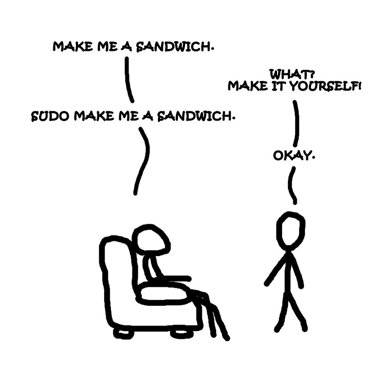

# Snips

Questo repository raccoglie i codici, le procedure e gli sporchi trucchi che non riesco mai a ricordare. Una sorta di taccuino personale che pubblico anche qui, nel caso che le mie ricette possano essere utili anche a qualcun altro.

Ha la forma di un vault [Obsidian](https://obsidian.md/): potete consultare i file direttamente qui oppure aprire l'archivio con Obsidian per la consultazione *off-line*.

Scorciatoie da tastiera: [HK Memo](99-SalaMacchine/HK%20Memo.md)

Se la vignetta qui sotto per voi non ha senso, siete certamente finiti nel posto sbagliato.

---
